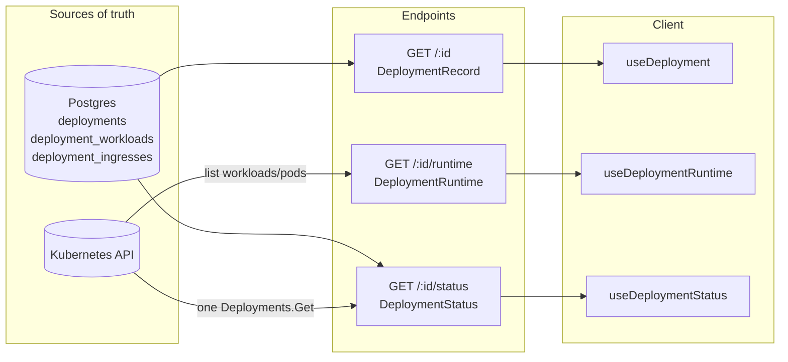
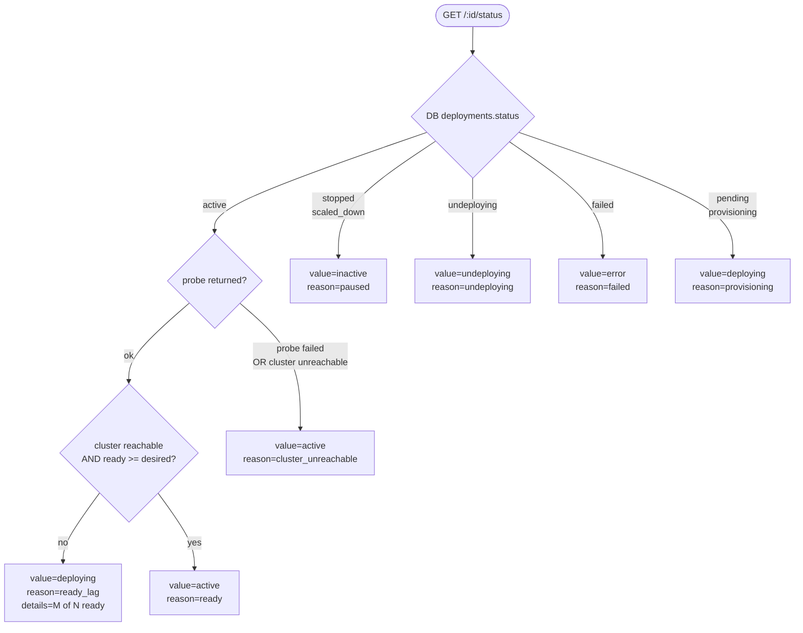
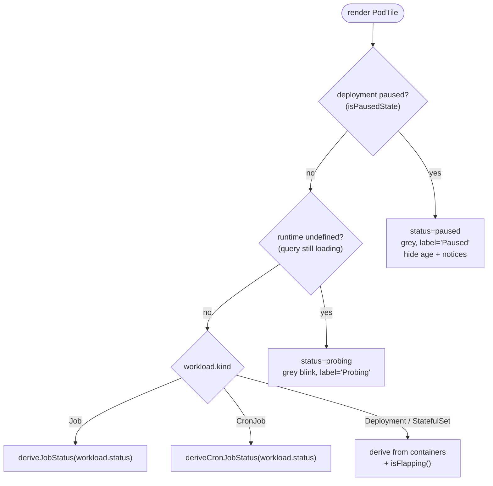
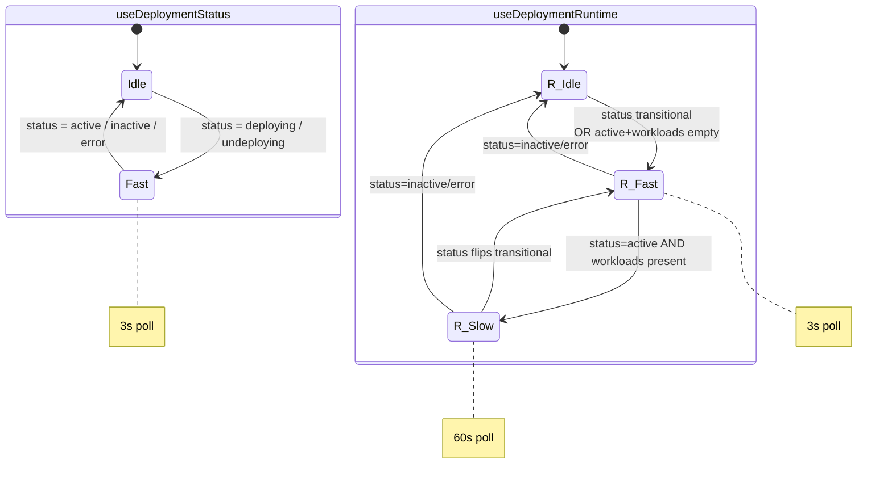

# Deployment endpoint split: record + runtime + status

## Summary

`GET /deployments/:id` was conflating three concerns: the static, DB-sourced
description of a deployment (spec, URL, status enum), the live K8s view
(replicas, pods, restart counts, events), and the *derived* status the UI
renders. The conflation meant the detail page issued 4–5 K8s API calls per
render even for fields the DB already had, broke when the cluster was
briefly unreachable, and produced timing-window bugs where the toggle/badge
stuck on "Deploying"/"Resuming" because the client was reconciling stale
runtime data against a freshly-mutated record.

This PR splits the endpoint into three with disjoint responsibilities:

| Endpoint | Source | What lives here |
|---|---|---|
| `GET /deployments/:id` | DB only | Spec, URLs, coarse status enum, intent-shaped workload list, messaging-configured flag |
| `GET /deployments/:id/runtime` | K8s only | Live replicas/ready, per-workload pod state (containers, restart counts, age), messaging-reachable probe |
| `GET /deployments/:id/status` | DB + one K8s probe | Server-derived rendering status, machine-readable `reason`, human-readable `details` |



## Design

**Record endpoint** is pure DB. Comments on `ListDeployments` and
`GetDeployment` explicitly prohibit Kubernetes reads — the architectural
contract is "if you want a K8s field, extend `DeploymentRuntime`." Renders
deterministically even when the cluster is unreachable, and keeps the
dashboard list endpoint cheap.

**Runtime endpoint** is the K8s-side counterpart. Stitched onto the record's
workload list by name on the client. Polls slowly in steady-state (60s) and
quickly (3s) while transitional or while the workload list is still empty.
Pause/resume/restart mutations invalidate it explicitly so the cache can't
linger on the pre-mutation snapshot.

**Status endpoint** is the load-bearing new piece. The server joins the DB
status enum + a single `Deployments.Get` for the agent's primary workload
and emits:

```json
{
  "value": "deploying",
  "reason": "ready_lag",
  "details": "1 of 3 replicas ready",
  "error_message": "..."
}
```

`value` is the coarse enum the badge renders.  `reason` is a stable
machine-readable code (`paused`, `ready_lag`, `cluster_unreachable`, …) the
client branches on. `details` is the human-readable sentence the toggle
tooltip displays — no client-side composition. When the cluster is
unreachable the server falls back to "active" with
`reason=cluster_unreachable`, so a brief outage doesn't drag the badge into
"Deploying".

Server-side decision flow:



## Client wiring

`useDeploymentStatus(id)` is the single source of truth for the rendered
status. `mapDeploymentStatus(deployment, runtime)`, `isDeployingState`,
`isLiveState`, and `hasContainerMismatch` are all deleted along with the
timing-window bugs they were patching.

Pod tiles never disappear on pause / resume. The spec workload list is the
stable source of truth for which tiles to render; the tile's *state*
(`paused` / `probing` / derived) is what changes. This eliminates the
flicker where all tiles vanished mid-transition while the runtime cache
caught up. Each tile state precedence:

1. `paused` — whole agent is off; greyed-out, replaces individual K8s
   statuses (so a Suspended CronJob no longer claims "Idle" while the
   agent is paused).
2. `probing` — runtime query is still loading; grey blinking dot makes "we
   don't know yet" visually distinct from "K8s says pending".
3. Derived — K8s-reported state per pod.



Mutations that change pod state (pause / resume / restart) invalidate
record + runtime + status via a shared `invalidateDeployment` helper. The
helper invalidates the `['deployments', 'detail', id]` prefix exactly once;
TanStack's prefix-match semantics fan that out to the runtime and status
children automatically.

Polling cadence after the rewrite:



Plus a one-shot invalidation of the detail-key prefix when status
transitions to `active` — the runtime cache from the deploying window is
stale at that moment, so we refetch exactly once instead of waiting for the
60s slow-poll boundary. The same invalidation also catches up the record
(URLs, build state) without needing a separate poll on `useDeployment` —
the record is DB-only and otherwise idle.

## Migration

None for users. The old `GET /deployments/:id/status` returned events +
revisions + raw DB status and had zero frontend consumers; it's been
replaced with the new minimal shape. The record + runtime endpoint shapes
changed but no external consumers depend on them.
