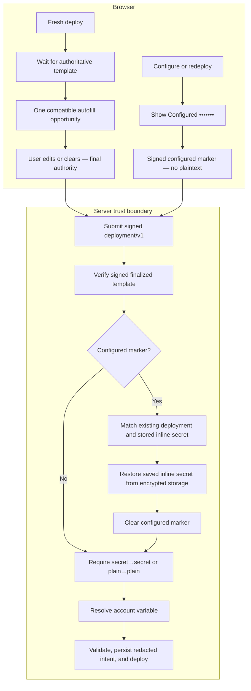

# Summary

Deploy-time autofill was trying to be helpful, but it could overwrite a user's choices or bring back a value they had cleared. During redeploy, an existing inline secret could also be decrypted by the server and returned to the browser as part of the finalized template.

Autofill is now limited to a one-time suggestion on fresh deploys, after the form is fully loaded. User edits and clears always win, configured secrets remain entirely server-side, secret fields can only bind secret references, and plain fields can only bind plain references.

Related: [#1671](https://github.com/astropods/astro/issues/1671), incorporating the duplicate report in [#1581](https://github.com/astropods/astro/issues/1581).

# Design

Autofill is a one-time suggestion with explicit provenance. It runs only after a fresh deploy form has finished seeding, never on configure or redeploy forms, and user edits, clears, imports, and picker selections remove the suggestion provenance. The form owns that provenance across interface toggles, so remounting a field cannot restore a cleared suggestion. Display-only object sub-fields do not offer vault references because they are serialized through their parent object rather than submitted independently. Saved inline secrets are presented as “Configured” rather than “Auto-filled.”

Fresh deploys wait for blueprint metadata before requesting their build-specific template, so an implicit template cannot race with and reseed over the selected build. Field updates also compose against the latest form state, preserving simultaneous matches across required, optional, and adapter credential sections.

The picker and form validation use account-variable metadata to offer and accept only type-compatible references. The server independently checks the referenced account variable against the deployment field before decryption, preventing a secret value from being resolved into plain deployment configuration or the reverse.

Finalized configure templates represent an unchanged inline secret with a signed, opaque `configured` marker instead of plaintext. The browser never receives the saved value. After signature verification, the deploy endpoint requires the referenced deployment to belong to the target account, matches the marker to an existing encrypted inline secret, restores the value inside the server apply path, and removes the marker before validation and persistence.

Preflight validation treats a valid `configured` marker as an opaque, fulfilled secret without loading or decrypting the stored value. The real deploy path remains strict: it must match the marker to an existing encrypted inline secret before applying the deployment.

The organization deploy gate remains target-account membership; this change does not add deployment or secret-use permissions. Redeploy identity binding is tightened: the referenced existing deployment must belong to the already-authorized target account, rather than merely belonging to another account of which the caller is also a member.

# Review order

1. **[`astro-spec` companion PR #1](https://github.com/astropods/astro-spec/pull/1)** — Review this first. It defines the shared opaque `configured` contract, accepts it during fulfilled-spec parsing, and strips it before persistence. This PR then advances `packages/astro-spec` to that commit.
2. **`apps/astro-server/internal/deployment`** — Review template shaping and preflight semantics: the server derives the marker from stored inline-secret state, carries it only when preserving an existing value, and treats it as fulfilled without decrypting during validation.
3. **`apps/astro-server/handlers`** — Review the trust boundary: finalized templates no longer contain stored plaintext, real deploys strictly match and restore marked secrets from encrypted storage, and account-variable references enforce secret/plain compatibility before decryption.
4. **`apps/astro-client/src`** — Review form authority from the page inward: wait for the authoritative template, enable autofill only for a seeded fresh deploy, compose concurrent field updates, keep edits and clears authoritative, and distinguish “Configured” from “Auto-filled.” The colocated tests cover each state transition.
5. **`apps/astro-client/e2e`** — Review last for the browser-level fresh-deploy suggestion and deploy-to-configure secret-preservation round trips.

# Migration

No migration is required. Existing compatible vault references and configured inline secrets continue to round-trip unchanged, with no organization role or permission changes.
