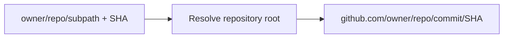

## Summary

Deployment history source links now resolve against the GitHub repository root, matching blueprint repository links when a blueprint is connected to a monorepo subdirectory. The branch-labeled link still opens the deployed commit, but no longer treats the selected directory as part of the repository name.

## Design

The shared commit URL helper removes the optional blueprint subpath before composing the GitHub commit route.

## Migration

No user action is required.

## Reviewer guide

- `github-utils.ts` — verify commit links use the existing repository-root resolver.
- `github-utils.test.ts` — check root, subpath, and missing-input coverage.
- `DeploymentHistoryPanel.test.tsx` — confirm the branch-labeled link handles a connected subdirectory.
