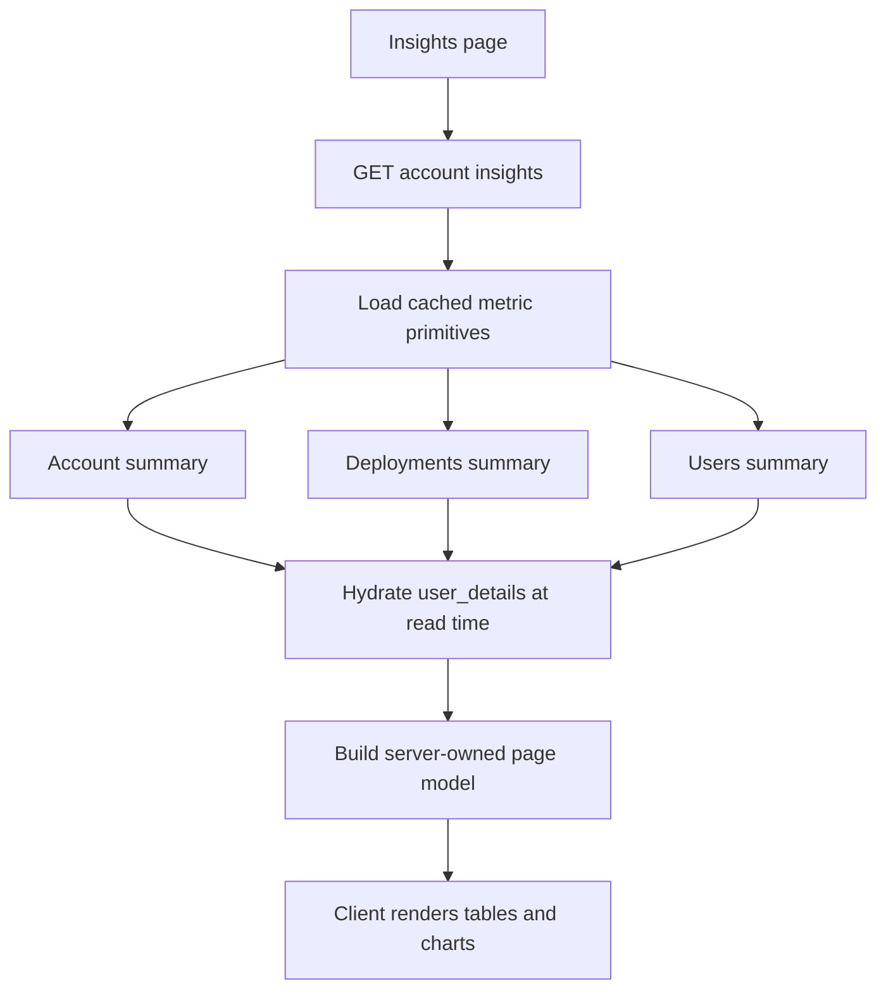
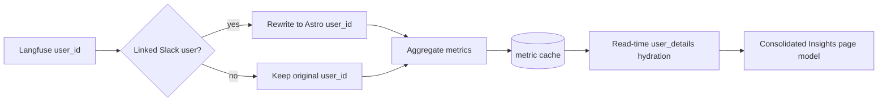

## Summary

Insights now loads through one server-owned page model instead of asking the
frontend to stitch together several observability APIs. The goal is to let the
server decide row identity, labels, links, chart windows, percentages, and
search text while the client stays a fast renderer.

This PR also incorporates the Slack identity/cache design from the recent
cache invalidation work: metric buckets remain cache-backed, but Slack display
details are resolved after cache reads.

## Design

The new account Insights endpoint returns the complete view model for the page:

- Supported ranges and stat-card values.
- Agent and people spend chart points.
- Agent and people table rows, sliced to the requested table window.
- Table pagination metadata: full count, filtered count, current limit, and
  whether more rows are available.
- Display labels, hrefs, row keys, percentages, and search text.

The lower-level observability endpoints still exist and remain the reusable
cache primitives. The consolidated endpoint composes those primitives into the
page response.

The important boundary is that the final consolidated page response itself is
not cached. It is rebuilt from warmed metric summaries on each request. That
keeps Saswat's split intact:

- Stable Slack-to-Astro linking happens before metric aggregation and cache
  writes.
- Dynamic profile fields like Slack name, avatar, and team metadata are
  hydrated after cached summaries are read.
- Consolidated table rows may include display labels and hrefs, but user-shaped
  identities carry the canonical `user_id` plus `user_details` payload instead
  of reintroducing flat Slack fields.

The frontend now treats Insights as a dumb renderer. Range selection and view
toggling are presentation choices, but table search, sort, and progressive
row loading are sent back to the consolidated endpoint. That keeps large
accounts from downloading every row just to render the first screen while still
letting search and sort operate over the complete server-owned row set.

The initial table window is intentionally small. “Show more” increases the
server-requested row limit in bounded increments; it does not ask the browser
to hydrate the full table unless the user explicitly keeps expanding it.

Once the client has received a full range payload for an account, table-only
interactions can request `skip_ranges=true`. Those responses return fresh
server-sorted/search-filtered tables with an empty `ranges` map, while the
client reuses the last full range payload for stat cards and charts. This keeps
pagination/search/sort snappy for large accounts without changing the initial
SSR/load shape.

Search input is debounced before updating the server query params, and inactive
Insights query variants are garbage-collected more aggressively than the shared
activity queries. This avoids retaining a large response for every intermediate
keystroke.

The client no longer fetches account members, deployment lists, or lower-level
summary payloads to classify table rows.

The consolidation also removes the temporary client-side hydration gates from
PR #1335. Complete refresh HTML is now handled by the SSR buffering fix in
PR #1342, so delaying the entire Insights page and chart panels until
hydration only creates a visible flash without protecting the real failure
mode.

## Migration

No user action is required. Existing lower-level observability endpoints remain
available for backend cache refresh and future API reuse, while the Insights
page uses the consolidated endpoint.
