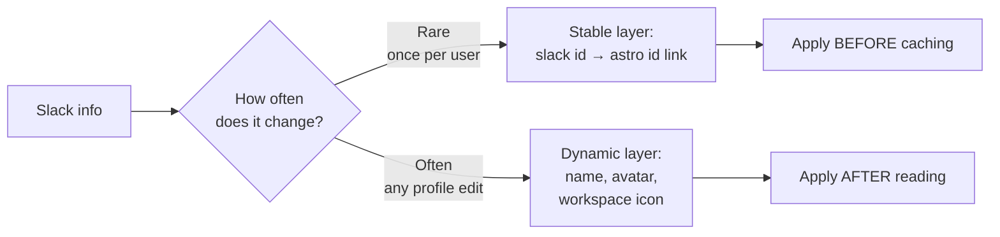
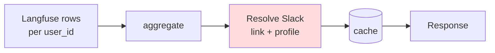
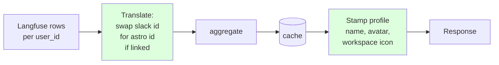
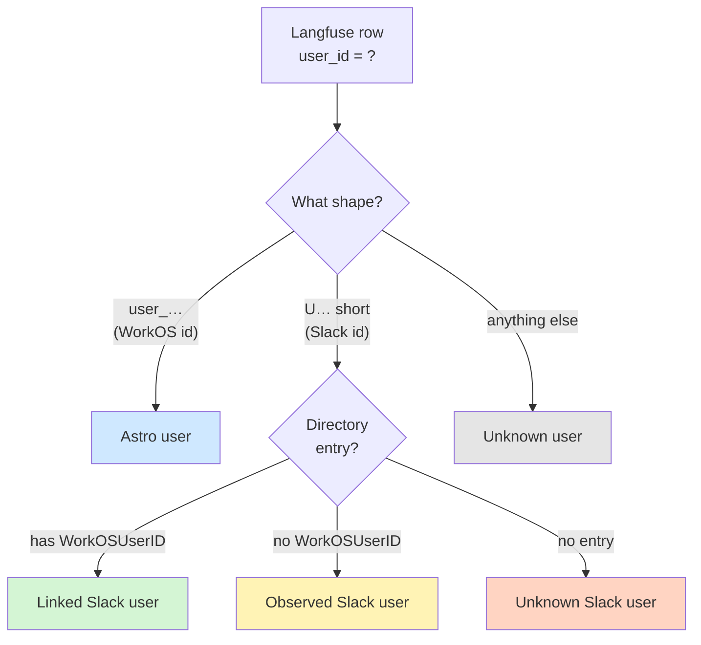
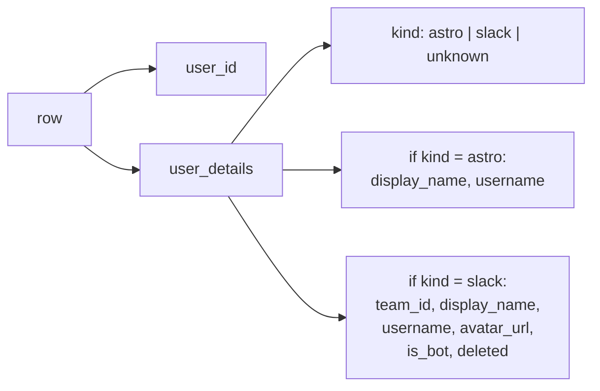
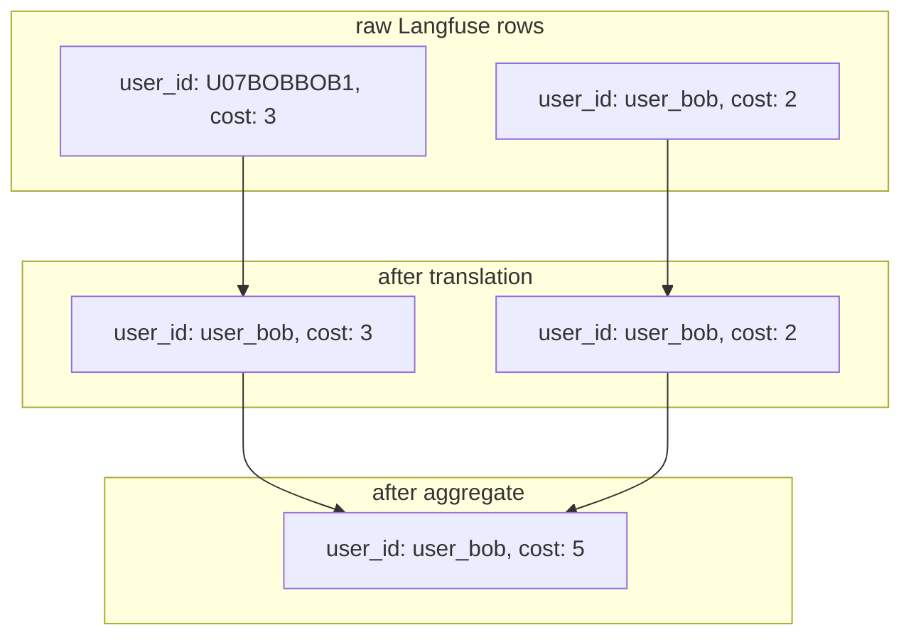

**Summary**

The Insights page was caching Slack profile data — names, avatars, workspace icons, even the slack→astro link state — alongside the metric numbers. So when someone updated their Slack avatar or connected their Slack account to Astro, the page kept showing the old data for up to 6 hours until the next refresh.

This PR fixes that by splitting the Slack data into two layers based on how often they change.

**The two layers**



The link from a Slack user to their Astro user is a one-time event — they connect once, and it sticks. So we can bake that into the cache. Names and avatars change all the time, so we look those up fresh on every read.

**Before this PR**

Everything was either cached together or busted together. A name change forced a full cache rebuild.



**After this PR**

The link step moves before the cache, and only profile data is resolved at read time.



**What this means for each kind of Slack info**

| Kind | Where it's handled | Why |
|---|---|---|
| `user_id` of a linked Slack user | Translated at compute time | Stable, baked into the bucket |
| `display_name`, `avatar_url` | Stamped at read time | Changes often, kept fresh |
| `workspace_name`, `workspace_icon_url` | Stamped at read time | Same |
| `slack_team_id` (deep link) | Stamped at read time | Same |

**The kinds of user a row can be**

Insights sees five categories of `user_id` in Langfuse. Each takes a different path through the pipeline:



| Kind | Example `user_id` | Translation at compute | Stamp at read | Final row shape |
|---|---|---|---|---|
| **Astro user** | `user_01HXX_bob` | No-op (not Slack) | No-op (not Slack) | Just the WorkOS id; frontend looks up name/avatar via the member API |
| **Linked Slack user** | `U07BOBBOB1` → `user_01HXX_bob` | Yes — rewritten to the Astro id | No-op (no longer Slack-shaped) | Merged with the Astro user's row, same shape as Astro user |
| **Observed Slack user** | `U07CAROL00` | No-op (no link in directory) | Yes — name, avatar, workspace icon, `slack_team_id` | Slack identity for display; opens Slack deep link |
| **Unknown Slack user** | `U07GHOSTLY` | No-op (no entry) | No-op (no entry) | Raw Slack id only; renders as a faceless row |
| **Unknown user** | anything that's neither | No-op | No-op | Whatever string Langfuse gave us; renders as raw text |

**New API shape**

The identity fields used to hang flat off every row (`slack_team_id`, `slack_display_name`, `slack_avatar_url`, … 9 fields, all optional, mostly empty). They're now a discriminated union under `user_details`:



`kind` is always present and is the discriminator. For `astro` rows, the server looks up the user's personal account to populate `display_name` + `username` — symmetric with the Slack-directory lookup. For `slack` rows, the directory fills in workspace + profile fields. The lookup is read-time, so both layers stay fresh across cache cycles.

**What each row looks like in the response**

These are entries inside the `users` array of `/observability/users-summary` — the same shape appears in `users_used_details` on deployments-summary, in `cost_over_time_by_user[].users` on account-summary, and on each trace row.

Astro user — a WorkOS id. The server hydrates `display_name` + `username` (the personal-account slug) from the per-user personal account row, so the frontend can render the user without a separate members lookup. Cross-account spend (public-blueprint deploys) also renders correctly because the lookup is global, not scoped to the current account:

```json
{
  "user_id": "user_01HXX_bob",
  "user_details": {
    "kind": "astro",
    "display_name": "Bob Smith",
    "username": "bob"
  },
  "requests": 42,
  "cost_usd": 7.50,
  "tokens": 12400,
  "last_seen": "2026-06-09T18:22:11Z",
  "agents_used": [
    {"deployment_id": "dep-code-reviewer", "name": "code-reviewer", "account": "postman"}
  ]
}
```

Linked Slack user — same shape as the Astro user. The Slack id was translated at compute time, so Bob's Slack spend (3 USD) and Astro spend (4.50 USD) live in this one row:

```json
{
  "user_id": "user_01HXX_bob",
  "user_details": {
    "kind": "astro",
    "display_name": "Bob Smith",
    "username": "bob"
  },
  "requests": 42,
  "cost_usd": 7.50,
  "tokens": 12400,
  "last_seen": "2026-06-09T18:22:11Z",
  "agents_used": [
    {"deployment_id": "dep-code-reviewer", "name": "code-reviewer", "account": "postman"}
  ]
}
```

Observed Slack user — directory has them but they haven't connected to Astro. Read-time stamping fills in the Slack profile fields and `team_id` (used to build the `slack://` deep link):

```json
{
  "user_id": "U07CAROL00",
  "user_details": {
    "kind": "slack",
    "team_id": "T07POSTMAN",
    "display_name": "Carol Chen",
    "username": "carol",
    "avatar_url": "https://avatars.slack-edge.com/carol.png",
    "is_bot": false,
    "deleted": false
  },
  "requests": 12,
  "cost_usd": 1.20,
  "tokens": 3100,
  "last_seen": "2026-06-08T09:15:00Z",
  "agents_used": [
    {"deployment_id": "dep-code-reviewer", "name": "code-reviewer", "account": "postman"}
  ]
}
```

Unknown Slack user — the user_id looks like a Slack id but the directory has nothing for them. The discriminator stays `slack` (we know what kind of id it is) but the metadata is empty — the frontend renders a faceless `Slack user - U07GHOSTLY` label:

```json
{
  "user_id": "U07GHOSTLY",
  "user_details": { "kind": "slack" },
  "requests": 3,
  "cost_usd": 0.18,
  "tokens": 420,
  "last_seen": "2026-06-07T11:02:00Z",
  "agents_used": []
}
```

Unknown user — not a WorkOS id, not a Slack id. Could be an SDK-emitted session token, a service account, or anything else the app puts in `user_id`:

```json
{
  "user_id": "anon-session-7f3c1a",
  "user_details": { "kind": "unknown" },
  "requests": 1,
  "cost_usd": 0.04,
  "tokens": 90,
  "last_seen": "2026-06-06T22:48:00Z",
  "agents_used": []
}
```

**Removed wire-format fields**

`identity_key`, `slack_team_id`, `slack_display_name`, `slack_username`, `slack_avatar_url`, `slack_is_bot`, `slack_deleted`, `slack_workspace_name`, `slack_workspace_domain`, `slack_workspace_icon_url` are gone from every endpoint. Their replacements live inside `user_details`. On traces, `identity` is replaced with `user_details` (the trace's `user_id` stays at the top level).

The frontend builds its React row key from `user_id` plus `user_details.team_id` (when present) — there's no server-emitted `identity_key` anymore.

**The bucketing pays off**

Before, Bob's Slack and Astro spend lived in two separate cached rows. Code had to merge them after-the-fact, which could drop the smaller row if the 500-user cap kicked in first. With translation, Bob's Slack `user_id` gets rewritten to his Astro `user_id` before bucketing, so the aggregation produces one row directly.



**Trade-off**

If someone links or unlinks their Slack account between two cache writes, that change waits for the next 6-hour refresh to show up. We picked this over rebuilding the cache on every link event because link events are rare and the staleness window is short.

**Removed**

- The post-OAuth `accountcache.InvalidateAccount` call in the Slack callback handler. Profile and link changes no longer need a cache bust to surface.
- The `mergeLinkedSlackRows` / `mergeInto` / `clearSlackDirectoryFields` helpers. The translation step removes the need for an after-the-fact merge.
- The admin gRPC `InvalidateAccountCaches` RPC stays — operators can still bust an account's caches manually from Queen.

**Migration**

None for callers. At deploy time, Redis will still hold Insights entries written by the previous build (flat `slack_*` fields, no `user_details`). The new code decodes those into a zero-value `UserDetails` and the resolver back-fills `kind` from the `user_id` shape via `classifyUserID`, so the same read-time stamping path takes over and rows render correctly on first read after deploy — no cache flush needed, no degraded window.
