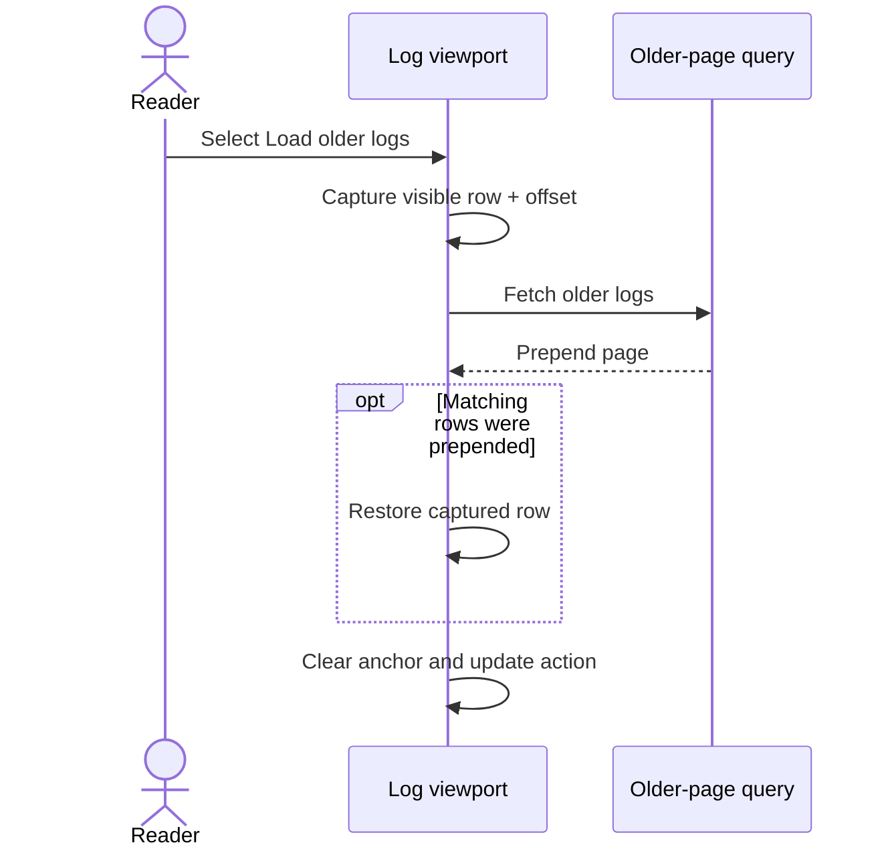

## Summary

Pod log history now loads through an explicit action instead of a fragile scroll threshold. Older entries no longer jump the reader to a different timestamp when they are prepended.

## Design

`Load older logs` is shown while another historical page is available and is disabled while that request is in flight. Before the request, the virtualized viewer records the first visible row and its viewport offset. After matching rows prepend, it restores that row by stable identity. Filtered and empty pages simply re-enable or remove the action according to query state; no separate pagination guard is required.

## Migration

No user action is required.

## Reviewer guide

- `PodLogsTab.tsx` — review the manual action and best-effort row restoration.
- `AgentDeployments.test.tsx` — verify explicit loading, anchoring, and filtered/empty pages.
