# Deployment State Tracking — Evaluation & Event-Driven Redesign

## Summary

A deployment is one `deployments` row that fans out into many child workloads
(deployments, statefulsets, jobs, sidecars, services, ingresses). Its lifecycle
state is a single `status` string set optimistically at K8s-apply time — it does
not reflect whether pods actually start. The legacy reconcile loop that was meant
to catch this is disabled and slated for deletion. This document proposes
replacing the poll-and-guess model with an **event-driven controller**: K8s
informers watch managed workloads, translate rollout signals into per-workload
status, and drive the deployment lifecycle in near-real-time. The controller
also becomes the write side of a DB **read-model** — both `/status` and
`/runtime` are served from persisted, controller-maintained tables instead of
per-request K8s reads (see [Runtime Read-Model](#runtime-read-model--runtime-reads-the-db)).

## The Fan-out

One `deployments` row maps to many independently-schedulable K8s objects. State
is tracked only on the parent; the children carry desired-state, no status.

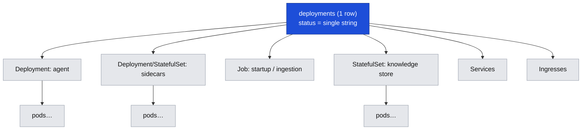

## Current Pattern (and why it's unreliable)

### State machine — `active` set on apply-accept

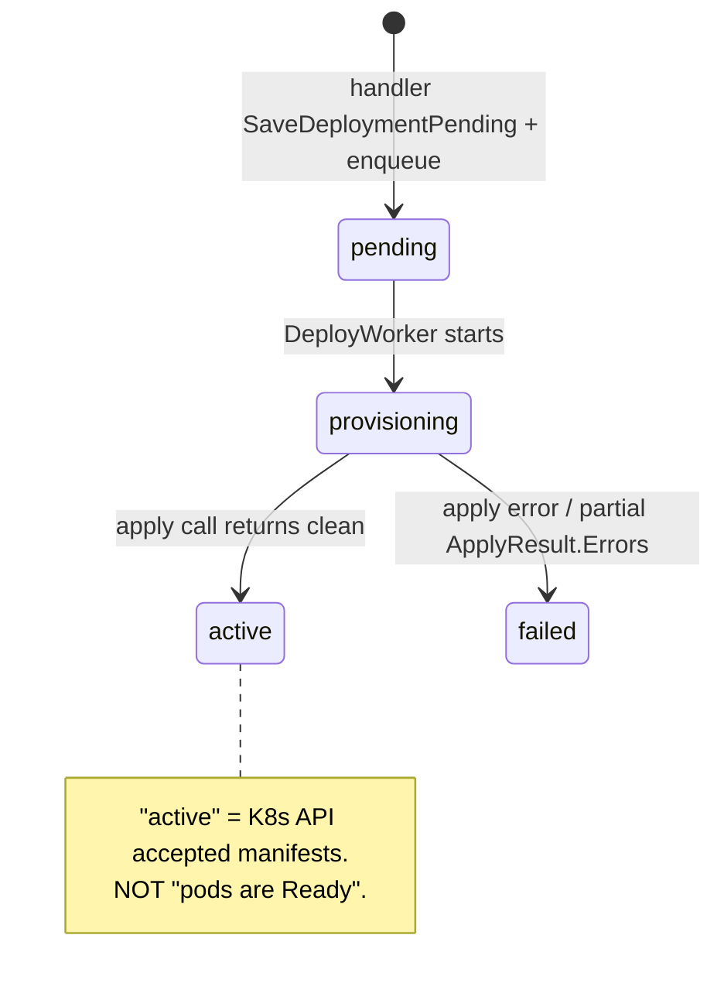

### Apply-then-forget

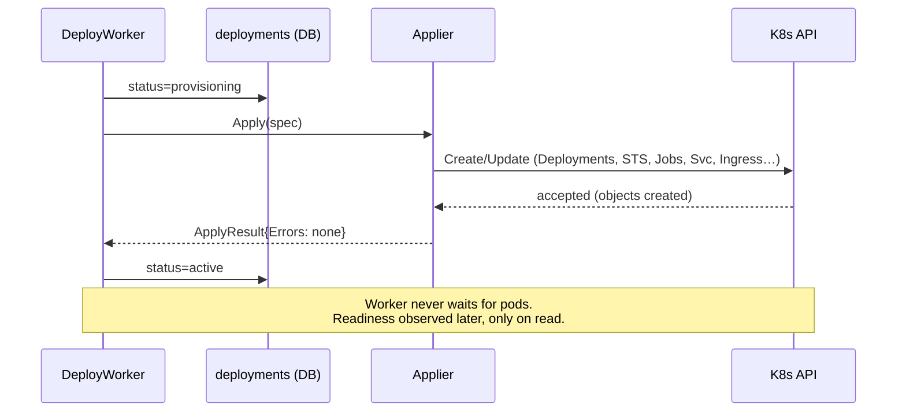

### The failure modes

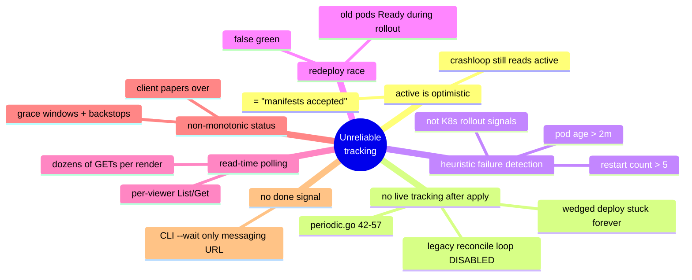

The legacy `ReconcileWorker` (periodic pod-failure escalation, drift, orphan
recovery) is **deleted** in this plan — it is disabled, heuristic, coupled to the
soon-removed `deployment_resolved_keys` table, and its responsibilities are
subsumed by the controller below.

## Proposed: Event-Driven Controller

Principle: a long-running controller **watches** managed workloads via K8s
informers and reacts to cluster events, rather than polling on a timer or on
read. `active`/`failed` become observed, aggregated states derived from real
rollout signals and persisted per-workload.

### Where it runs — worker vs API split

`astro-worker` runs `replicas: 1` (all River workers + periodic jobs).
`astro-server` (API) runs multiple replicas with an insert-only queue. The
controller lives in the **single-replica worker**, so there is a single writer —
no leader election needed today. Because the API replicas cannot see the
worker's in-memory informer cache, the controller **persists observed state to
the DB**, and the API reads from there.

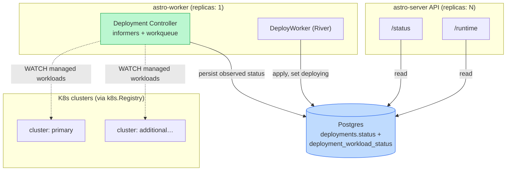

### Controller internals

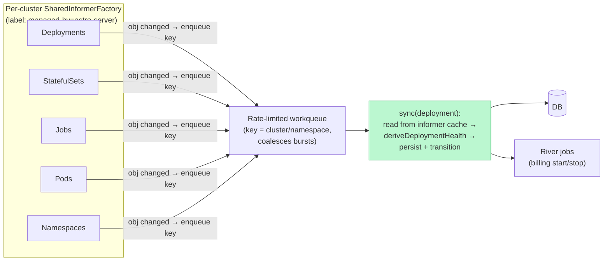

1. **Per-cluster informers.** One `SharedInformerFactory` per cluster from
   `k8s.Registry`, label-scoped to `app.kubernetes.io/managed-by=astro-server`,
   watching Deployments, StatefulSets, Jobs, Pods, and Namespaces. Each is a
   single LIST+WATCH — replacing all per-viewer List/Get and the old
   cluster-wide pod List.

2. **Coalescing workqueue.** Event handlers don't do work inline; they map the
   changed object to a deployment key (cluster/namespace) and enqueue. Bursty
   pod events for one deployment collapse into a single unit of work. A small
   worker pool drains the queue.

3. **Sync function (idempotent).** For a key: read that deployment's workloads
   from the informer **cache** (no API calls), run the shared
   `deriveDeploymentHealth(observations, intent)`, then upsert
   `deployment_workload_status`, aggregate to `deployments.status` (write only on
   change), append a `deployment_events` row on transition, invalidate the deploy
   cache, and enqueue side-effect River jobs (billing).

4. **Resync as the backstop.** The informer's periodic resync re-delivers all
   cached objects, forcing a full re-derivation — this self-healing tick replaces
   the deleted reconcile cron. On worker restart the informer does a fresh LIST,
   re-enqueuing every deployment, so state rebuilds from ground truth with no
   missed-event gap.

### Deploy flow — apply hands off to the controller

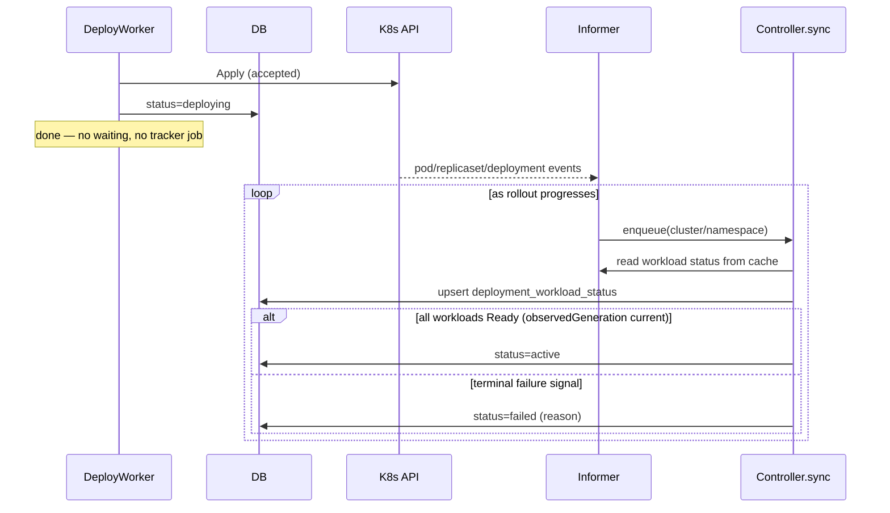

### Proposed state machine

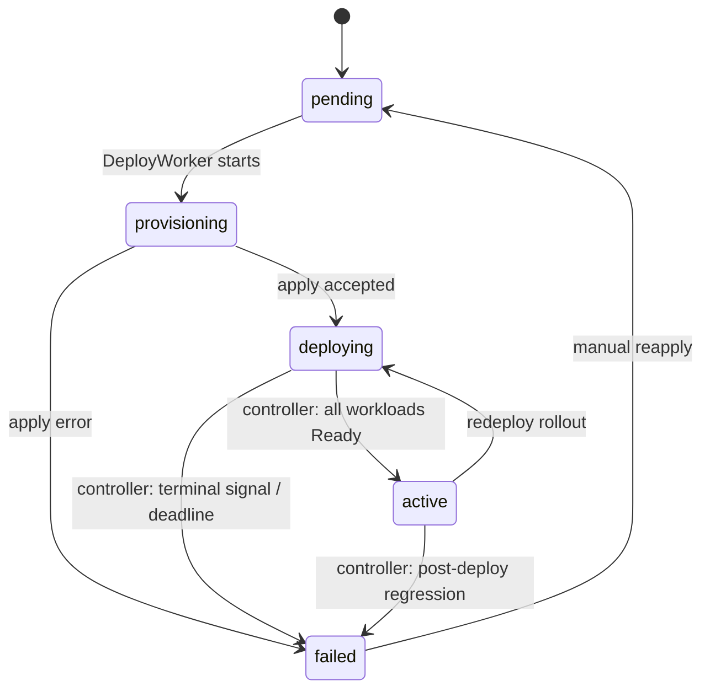

### Failure taxonomy — from K8s signals, not heuristics

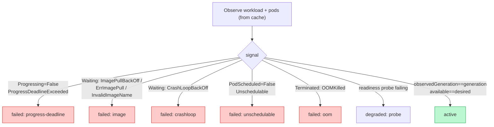

Readiness rules per workload type: **Deployment** — `observedGeneration ==
generation` AND `availableReplicas == desired` AND `Progressing` reason
`NewReplicaSetAvailable`; set `progressDeadlineSeconds` so K8s emits a
deterministic failure. **StatefulSet** — `updatedReplicas == readyReplicas ==
desired` AND `updateRevision == currentRevision`. **Job** — `JobComplete` /
`JobFailed` conditions. The `observedGeneration`/`updatedReplicas` checks close
the redeploy false-green (old ReplicaSet Ready while the new one rolls out).

### Persisted per-workload status

New table `deployment_workload_status` (materialized view written by the
controller, read by the API): `deployment_id`, `workload_name`, `phase`,
`reason`, `message`, `observed_ready`, `observed_desired`,
`observed_generation`, `observed_at`. The parent `deployments.status` becomes a
pure aggregate. This is load-bearing (not a cache): the API replicas have no
informer, so the DB is their only view of cluster state.

## Deleting the legacy reconcile worker

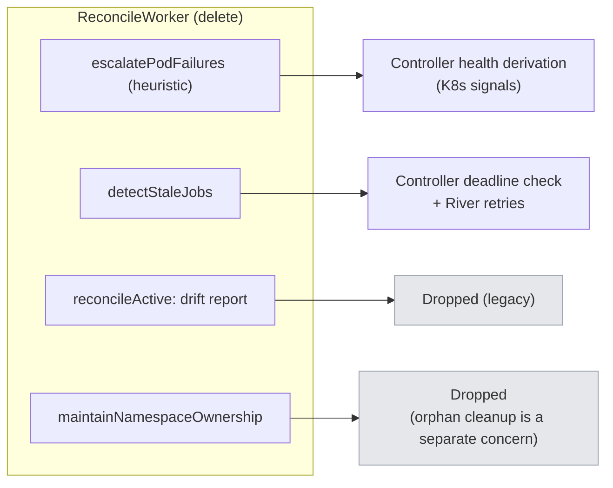

| Legacy step | Fate |
|---|---|
| `escalatePodFailures` (age>2m, restart>5) | Replaced by controller health derivation from K8s rollout signals |
| `detectStaleJobs` (provisioning>15m, pending>30m, re-enqueue) | Controller deadline check on `deploying`/`pending` via `status_changed_at`; River `MaxAttempts` covers apply retries |
| `reconcileActive` drift report | Dropped as legacy (rebuild on `deployment_build_env` later only if operators need it) |
| `maintainNamespaceOwnership` orphans | Dropped — orphaned-namespace cleanup is a separate operational concern, not part of this initiative |

Deleting it also removes the `deployment_resolved_keys` coupling that blocked
re-enabling it.

## Runtime Read-Model — `/runtime` reads the DB

Phase 3 left `/runtime` as a live K8s read (per-container detail the aggregate
`deployment_workload_status` table didn't hold). This phase closes that: the
controller persists the *full* observed runtime — every workload, all pods, all
containers, all services — as one JSONB document, and `/runtime` projects it
instead of hitting the cluster. Same pattern as `/status`, extended to the last
live endpoint.

**Before vs after — where the read goes:**

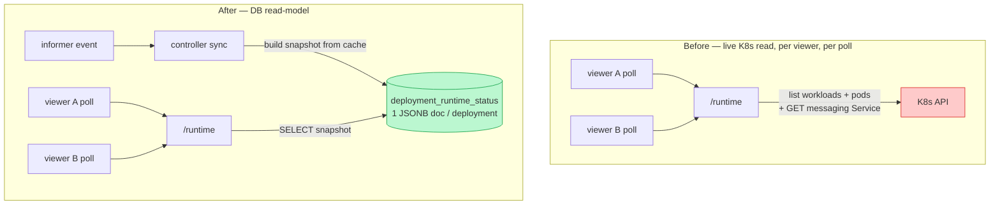

**Why one JSONB document, not normalized tables.** The runtime view is read
whole and rendered whole — never queried by an inner field — so there is nothing
to index on. A document matches the read shape, keeps the write a single atomic
upsert, and stays generic: more pods, containers, or services are just more
JSON, never a migration.

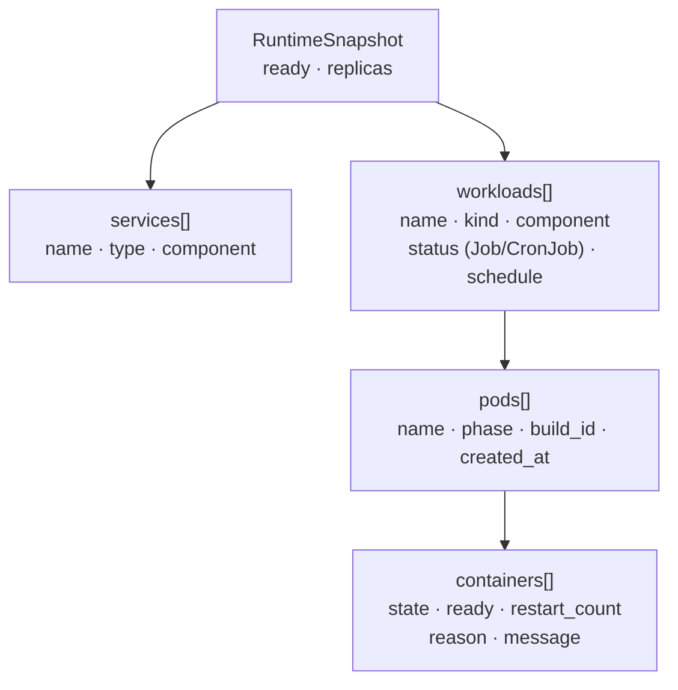

**Write path (controller) and read path (API):**

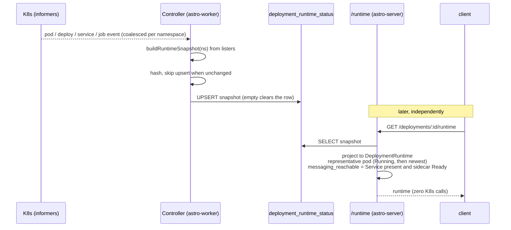

**Consequences.** `/runtime` becomes cluster-independent: a disabled or
unreachable cluster returns the last-observed snapshot (or an empty runtime the
UI already renders as "loading"), where it used to return `503`. There is no
live fallback — an unobserved deployment reads empty until the controller's
first sync. This makes the controller the *sole* writer of the runtime view, so
its HA (below) matters more.

- **Adds a Services informer** to the controller (Services carry
  `managed-by=astro-server`, so the same label-scoped factory sees them).
- **Content-diffed writes** — a steady-state resync doesn't rewrite the row; an
  empty snapshot clears it and evicts the diff-cache entry.
- **Not moved:** `manual_ingestions` (still a namespace annotation, slated for
  the DB) — carried in the shape, not yet populated.

## Phasing

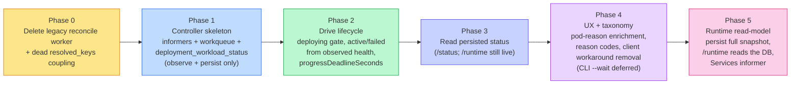

- **Phase 0 — Remove legacy.** Delete `ReconcileWorker`, its registration, the
  commented periodic job, and the `deployment_resolved_keys` coupling.
- **Phase 1 — Controller skeleton.** Per-cluster informers + coalescing
  workqueue + `deployment_workload_status`; observe and persist only, no
  transitions yet (shadow mode — compare against current behavior).
- **Phase 2 — Drive the lifecycle.** Introduce `deploying`; controller drives
  `deploying → active/failed` from observed health; set
  `progressDeadlineSeconds`; move billing to the real transition.
- **Phase 3 — Read persisted status.** Switch API `/status` to trust the
  controller-maintained status instead of probing K8s per request. `/runtime`
  stayed live here (per-container detail the aggregate table didn't hold) — later
  superseded by Phase 5. Orphan detection is dropped (orphaned-namespace cleanup
  is a separate concern); stale-`pending`/`provisioning` recovery is cut for now.
- **Phase 4 — UX + taxonomy.** Pod-reason enrichment (ImagePullBackOff /
  CrashLoopBackOff / OOMKilled → specific `failed` reason, fast, before the
  progress deadline); reason codes threaded end-to-end; remove the client status
  workarounds (resume grace window + stuck-by-age heuristic). CLI `--wait`
  repoint deferred.
- **Phase 5 — Runtime read-model.** Controller persists the full observed
  runtime (workloads → pods → containers, plus services) as one JSONB document;
  `/runtime` projects it instead of reading K8s per request. Adds a Services
  informer and content-diffed writes; `/runtime` becomes cluster-independent (no
  more `503` on a down cluster). `manual_ingestions` not yet moved off its
  namespace annotation.

## Open Decisions

- **HA of the controller.** Relies on `astro-worker` staying `replicas: 1`
  (single writer). If the worker ever scales out, wrap the controller in
  client-go leader election (a `Lease`). Recommend designing the entrypoint so
  leader election can be added without restructuring. **This matters more after
  Phase 5:** the controller is now the sole writer of both `/status` and
  `/runtime`, so a controller outage freezes the runtime view (it goes stale
  silently rather than erroring) — leader election should land before scaling
  the worker.
- **Resync period.** The safety-net cadence for full re-derivation (e.g. 1–2m) —
  trades API-server relist cost against staleness bound.
- **Deadline ownership.** Rely on K8s `progressDeadlineSeconds` for Deployments;
  for Jobs and stuck-`pending` (no object yet), the controller needs its own
  timer keyed on `status_changed_at`, checked on resync.

## Key Seams

- `DeployWorker.Work` (`internal/riverqueue/deploy.go:132`) — stop setting
  `active`; set `deploying` and hand off to the controller.
- `internal/riverqueue/reconcile.go` + `periodic.go:42-57` — delete.
- New: controller package started from the worker entrypoint
  (`riverqueue/client.go` `New`, the workers-enabled path), one informer factory
  per `k8s.Registry` cluster.
- `GetDeploymentStatus` — reads persisted `deployment_workload_status`
  (Phase 3). `GetDeploymentRuntime` — reads `deployment_runtime_status` and
  projects the snapshot; no K8s client calls (Phase 5).
- `internal/deploycontroller/runtime.go` — `buildRuntimeSnapshot` assembles the
  snapshot from the informer caches; `controller.go` adds the Services informer
  and content-diffed `persistRuntimeSnapshot`.
- `deploymentstore/runtime_status.go` — `RuntimeSnapshot` types +
  `UpsertRuntimeSnapshot` / `GetRuntimeSnapshot`.
- `applier.go` / `spec_applier.go` — set `progressDeadlineSeconds` on Deployments.
