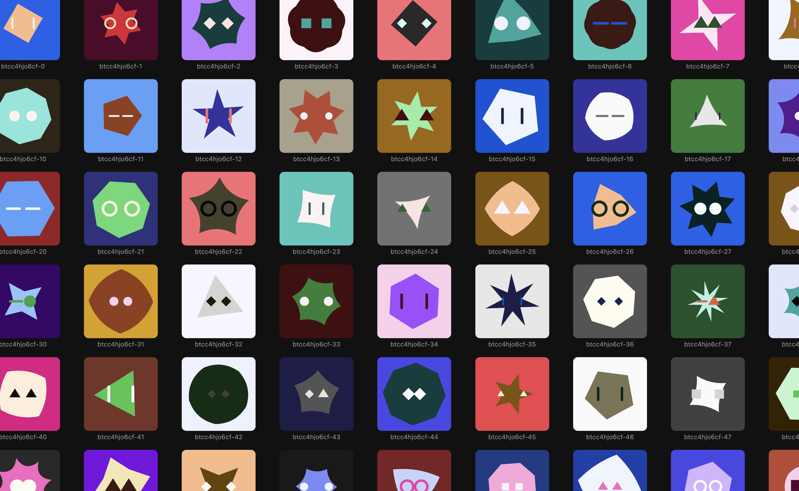

# @saswatds/astro-identity-gen

Procedural SVG identity generator. Takes a seed string and deterministically produces a unique visual identity — useful for avatars, placeholders, or visual identifiers for agents, users, or resources.



## Install

```bash
bun add @saswatds/astro-identity-gen
```

## Usage

```ts
import { generateIdentity } from "@saswatds/astro-identity-gen";

const svg = generateIdentity({ seed: "my-agent-id" });
// Returns an SVG string

// Optional: set size (default 128)
const large = generateIdentity({ seed: "my-agent-id", size: 256 });
```

The same seed always produces the same identity.

## What gets generated

Each identity is a layered SVG composed of:

- **Background** — a colored rectangle
- **Polygon** — a shape with 3–8 sides and one of four edge styles:
  - Flat (straight edges)
  - Spikey (star-like alternating radii)
  - Scalloped (outward-curved edges)
  - Inverse scalloped (inward-curved edges)
- **Eyes** — a pair of minimal shapes from 8 styles: dots, rings, slits, triangles, dashes, squares, semicircles, diamonds. ~10% chance of mismatched left/right eyes.

Colors are drawn from the Astro design system palette (11 hues, 11 shades each) with contrast guards ensuring layers are visually distinct.

~4.3 billion unique identities (bounded by 32-bit RNG).

## Development

```bash
# Start the preview server (watches for changes, auto-reloads)
bun run dev

# Export 100 random SVGs to build/
bun run export
```
